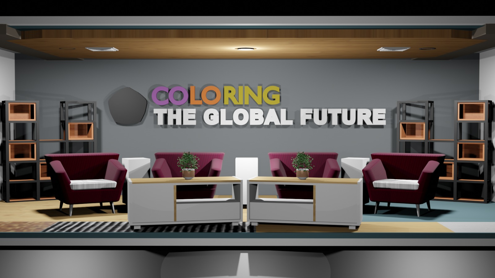

# Ruang Shooting UG TV dengan Blender

Selamat datang di index.md tentang bagaimana menggunakan Blender untuk membuat ruang shooting UG TV. Dalam panduan ini, kami akan membahas langkah-langkah untuk membuat ruang shooting virtual yang realistis dengan bantuan perangkat lunak Blender. Mari kita mulai!

## Daftar Isi
1. Pendahuluan
2. Persiapan Awal
3. Membuat Model Ruangan
4. Pencahayaan dan Penyetingan Materi
5. Penambahan Objek dan Perlengkapan TV
6. Animasi Kamera
7. Pengaturan Render
8. Kesimpulan

## 1. Pendahuluan
Ruang shooting UG TV virtual memungkinkan Anda untuk membuat studio televisi yang interaktif dan realistis. Dengan Blender, Anda dapat merancang ruangan, menambahkan perlengkapan TV, dan mengatur pencahayaan dengan mudah.

## 2. Persiapan Awal
Sebelum memulai, pastikan Anda telah menginstal Blender dan menguasai dasar-dasar penggunaannya. Juga, kumpulkan referensi tentang ruang shooting UG TV agar dapat merancang dengan lebih baik.

## 3. Membuat Model Ruangan
Mulailah dengan membuat model ruangan yang akan digunakan untuk shooting UG TV. Anda dapat menggunakan tools modeling di Blender untuk membuat dinding, lantai, dan langit-langit ruangan. Pastikan untuk memperhatikan proporsi dan skala agar ruangan terlihat realistis.

## 4. Pencahayaan dan Penyetingan Materi
Pencahayaan memainkan peran penting dalam menciptakan suasana di ruang shooting. Gunakan pencahayaan dalam Blender untuk menentukan sumber cahaya dan intensitasnya. Anda juga dapat mengatur penyetingan materi agar objek-objek dalam ruangan terlihat seperti yang diinginkan.

## 5. Penambahan Objek dan Perlengkapan TV
Tambahkan objek-objek seperti meja, kursi, kamera, mikrofon, monitor, dan perlengkapan TV lainnya ke dalam ruangan. Pastikan objek-objek tersebut ditempatkan dengan baik dan sesuai dengan kebutuhan produksi TV.

## 6. Animasi Kamera
Buatlah animasi kamera untuk memberikan pandangan yang dinamis dalam ruangan. Anda dapat membuat kamera bergerak, zoom, atau mengikuti pergerakan objek di ruangan. Eksplorasi variasi sudut pandang untuk mendapatkan hasil yang menarik.

## 7. Pengaturan Render
Sebelum melakukan proses render, tentukan pengaturan render yang sesuai dengan kebutuhan Anda. Pilih resolusi, format file, dan pengaturan lainnya agar hasil render sesuai dengan ekspektasi.

## 8. Kesimpulan
Dalam panduan ini, kami telah membahas langkah-langkah dasar untuk membuat ruang shooting UG TV dengan Blender. Dari pembuatan model ruangan hingga penambahan objek dan animasi kamera, Anda dapat menciptakan ruang shooting yang realistis dan interaktif. Selanjutnya, Anda dapat mengeksplorasi lebih lanjut dengan menambahkan detail dan efek khusus sesuai kebutuhan produksi TV Anda.

Sekarang Anda memiliki dasar untuk memulai perancangan ruang shooting UG TV menggunakan Blender. Selamat mencoba dan semoga berhasil!